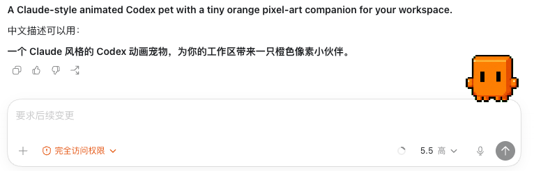
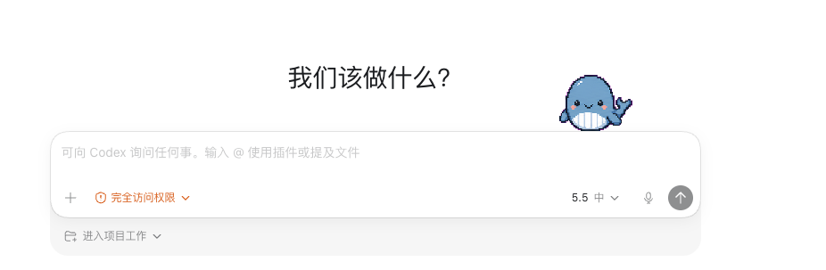
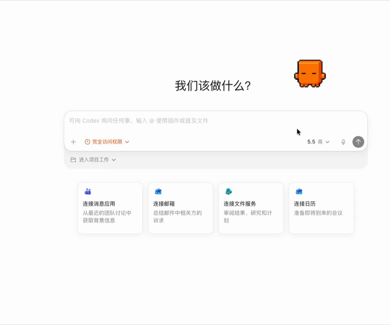

# Agent Pet

[中文](./README.zh-CN.md) | English

Agent Pet is a lightweight desktop pet for AI agent activity. It floats on your desktop, plays Codex-compatible sprite animations, and reacts to local WebSocket messages or activity from supported agent tools.

It is built with Tauri v2, Rust, React, and Vite.

## Features

- Codex-compatible pet sprites: `1536x1872`, `8x9` atlas, `192x208` cells.
- Built-in WebSocket endpoint at `ws://127.0.0.1:8765`.
- Local activity monitoring for Codex CLI, Claude Code, opencode, OpenClaw, and Hermes Agent.
- Customizable source paths and optional source prefixes.
- Custom pet support through a user pet directory.
- Floating transparent desktop window, settings window, system tray, drag movement, and pet size presets.
- Security checks for pet IDs, sprite paths, file extensions, and sprite dimensions.

## Screenshot




## Demo

[](./docs/media/agent-pet-demo.mp4)

[Watch the MP4 demo](./docs/media/agent-pet-demo.mp4)

## Platform Status

- macOS has been tested locally.
- Windows support is planned and currently being tested.
- Linux should work in principle through Tauri, but has not been fully verified yet.

## Requirements

- Node.js 18+
- Rust 1.77.2+
- Platform requirements for Tauri v2:
  - macOS: Xcode command line tools
  - Windows: WebView2
  - Linux: WebKitGTK and common Tauri system libraries

## Install

```bash
git clone https://github.com/xiangking/agent-pet.git
cd agent-pet
npm install
```

## Run Locally

```bash
npm run tauri dev
```

## Build

```bash
npm run build
npm run tauri build
```

The generated app bundles are written to:

```text
src-tauri/target/release/bundle/
```

Windows installer build:

```bash
npm run build:windows
```

Run the Windows build on Windows with Rust, Node.js, WebView2, and the Tauri prerequisites installed.

## Usage

1. Start Agent Pet.
2. Open the tray menu and choose Settings.
3. Choose a pet, size, live source settings, and WebSocket settings.
4. Send WebSocket messages or enable local source monitoring.

The default built-in pet is `claude`.

## Pet Locations

Agent Pet loads pets from two places. User pets have priority over built-in pets.

```text
<user-config>/agent-pet/pets/<pet-id>/   # user pets
{project}/pets/<pet-id>/                 # built-in pets
```

Typical user pet locations:

```text
macOS:   ~/Library/Application Support/agent-pet/pets/
Linux:   ~/.config/agent-pet/pets/
Windows: %APPDATA%\agent-pet\pets\
```

Each pet folder should contain:

```text
my-pet/
  pet.json
  spritesheet.webp
```

`spritesheet.png` is also supported.

## Pet Format

Example `pet.json`:

```json
{
  "id": "my-pet",
  "displayName": "My Pet",
  "description": "A desktop companion",
  "spritesheetPath": "spritesheet.webp",
  "messageMap": {
    "new_message": "waving",
    "mention": "jumping",
    "error": "failed",
    "processing": "running",
    "waiting_input": "waiting",
    "review_required": "review",
    "success": "waving",
    "idle": "idle"
  }
}
```

Sprite atlas requirements:

| Property | Value |
| --- | --- |
| Dimensions | `1536x1872` |
| Grid | `8` columns x `9` rows |
| Cell size | `192x208` |
| Format | WebP or PNG |
| Background | Transparent recommended |

Animation rows:

| Row | State | Frames |
| --- | --- | --- |
| 0 | `idle` | 6 |
| 1 | `running-right` | 8 |
| 2 | `running-left` | 8 |
| 3 | `waving` | 4 |
| 4 | `jumping` | 5 |
| 5 | `failed` | 8 |
| 6 | `waiting` | 6 |
| 7 | `running` | 6 |
| 8 | `review` | 6 |

## WebSocket API

Agent Pet listens on:

```text
ws://127.0.0.1:8765
```

Message format:

```json
{
  "message_type": "new_message",
  "payload": {},
  "source": "my-tool"
}
```

Supported message types:

| Message type | Default animation |
| --- | --- |
| `new_message` | `waving` |
| `mention` | `jumping` |
| `error` | `failed` |
| `processing` | `running` |
| `waiting_input` | `waiting` |
| `review_required` | `review` |
| `success` | `waving` |
| `idle` | `idle` |

Example with `websocat`:

```bash
websocat ws://127.0.0.1:8765
```

Then send:

```json
{"message_type":"processing","source":"manual"}
```

## Live Sources

Agent Pet can watch local activity files from:

- Codex CLI
- Claude Code
- opencode
- OpenClaw
- Hermes Agent

The paths are configurable in Settings. Source prefixes are optional and disabled by default, so assistant replies can appear as clean pet bubbles.

The app is designed to ignore user-authored messages where the source format makes the role clear, and show assistant/tool activity instead.

## Project Structure

```text
agent-pet/
  src/                 React frontend
  src-tauri/           Tauri/Rust backend
  pets/                built-in pets
  icons/               app icons
  ASSETS.md            asset and redistribution notes
  README.md            English README
  README.zh-CN.md      Chinese README
```

Important backend modules:

```text
src-tauri/src/pet.rs             pet loading and validation
src-tauri/src/state_machine.rs   animation state and live source settings
src-tauri/src/websocket.rs       local WebSocket server
src-tauri/src/codex_monitor.rs   local agent activity monitors
src-tauri/src/tray.rs            system tray
```

## Development

Useful commands:

```bash
npm run dev
npm run build
npm run tauri dev
npm run tauri build
cargo test --manifest-path src-tauri/Cargo.toml
```

If you are working offline after dependencies have already been downloaded:

```bash
CARGO_NET_OFFLINE=true cargo test --manifest-path src-tauri/Cargo.toml
CARGO_NET_OFFLINE=true npm run tauri build
```

## Security

- WebSocket binds to `127.0.0.1` for local integrations.
- Pet IDs are validated to prevent path traversal.
- Sprite paths are canonicalized and restricted to allowed pet directories.
- Only `.webp` and `.png` sprite files are accepted.
- Sprite dimensions are validated before loading.
- See [ASSETS.md](./ASSETS.md) before publishing bundled visual assets.

## Roadmap

- Public release builds for macOS, Windows, and Linux.
- GitHub Actions release packaging.
- More built-in pets.
- More live source adapters.
- Import/export for pet settings.

## Contributing

Issues and pull requests are welcome.

## Acknowledgements

Thanks to OpenAI for the inspiration behind the agent-pet idea and for reference material that helped shape parts of this project.
Thanks to Claude and DataWhale for the cute pet characters that inspired the visual style used here.

## License

[MIT](./LICENSE)
