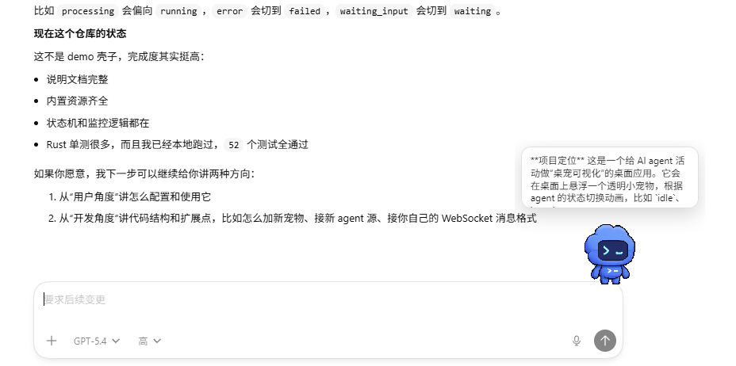

# Agent Pet

中文 | [English](./README.md)

Agent Pet 是一个轻量级 AI Agent 桌面宠物。它会悬浮在桌面上，使用兼容 Codex pet 协议的 spritesheet 动画，并且可以响应本地 WebSocket 消息或已支持的 Agent 工具活动。

项目使用 Tauri v2、Rust、React 和 Vite 构建。

## 功能

- 兼容 Codex pet spritesheet：`1536x1872`、`8x9` 图集、单格 `192x208`。
- 内置 WebSocket 地址：`ws://127.0.0.1:8765`。
- 支持监听 Codex CLI、Claude Code、opencode、OpenClaw、Hermes Agent、Antigravity 的本地活动。
- 支持自定义监听路径，支持可选的软件来源前缀。
- 支持用户自定义 pet。
- 透明悬浮桌面窗口、设置窗口、系统托盘、拖动移动、精灵尺寸选项。
- 对 pet ID、spritesheet 路径、文件扩展名、图片尺寸做安全校验。

## 截图




第三张截图拍摄于 Windows。

## 演示

[](./docs/media/agent-pet-demo.mp4)

[查看 MP4 演示视频](./docs/media/agent-pet-demo.mp4)

## 平台状态

- macOS 已完成本地测试。
- Windows 已完成本地测试。
- Linux 理论上可通过 Tauri 支持，但目前还没有完整验证。

## 环境要求

- Node.js 18+
- Rust 1.77.2+
- Tauri v2 平台依赖：
  - macOS：Xcode command line tools
  - Windows：WebView2
  - Linux：WebKitGTK 以及常见 Tauri 系统库

## 安装

```bash
git clone https://github.com/xiangking/agent-pet.git
cd agent-pet
npm install
```

## 本地运行

```bash
npm run tauri dev
```

## 构建

```bash
npm run build
npm run tauri build
```

构建产物会输出到：

```text
src-tauri/target/release/bundle/
```

Windows 安装包构建：

```bash
npm run build:windows
```

Windows 构建建议在 Windows 机器上执行，并提前安装 Rust、Node.js、WebView2 和 Tauri 所需依赖。

## 使用方式

1. 启动 Agent Pet。
2. 在系统托盘菜单里打开 Settings。
3. 选择 pet、尺寸、实时来源和 WebSocket 设置。
4. 发送 WebSocket 消息，或者开启本地 Agent 活动监听。

默认内置 pet 是 `claude`。

## Pet 放置位置

Agent Pet 会从两个位置加载 pet。用户自定义 pet 的优先级高于内置 pet。

```text
<user-config>/agent-pet/pets/<pet-id>/   # 用户自定义 pet
{project}/pets/<pet-id>/                 # 项目内置 pet
```

常见用户 pet 目录：

```text
macOS:   ~/Library/Application Support/agent-pet/pets/
Linux:   ~/.config/agent-pet/pets/
Windows: %APPDATA%\agent-pet\pets\
```

每个 pet 文件夹应包含：

```text
my-pet/
  pet.json
  spritesheet.webp
```

也支持 `spritesheet.png`。

## Pet 格式

`pet.json` 示例：

```json
{
  "id": "my-pet",
  "displayName": "My Pet",
  "description": "A desktop companion",
  "spritesheetPath": "spritesheet.webp",
  "messageMap": {
    "new_message": "waving",
    "mention": "jumping",
    "error": "failed",
    "processing": "running",
    "waiting_input": "waiting",
    "review_required": "review",
    "success": "waving",
    "idle": "idle"
  }
}
```

Spritesheet 要求：

| 属性 | 值 |
| --- | --- |
| 图片尺寸 | `1536x1872` |
| 网格 | `8` 列 x `9` 行 |
| 单格尺寸 | `192x208` |
| 格式 | WebP 或 PNG |
| 背景 | 推荐透明 |

动画行定义：

| 行 | 状态 | 帧数 |
| --- | --- | --- |
| 0 | `idle` | 6 |
| 1 | `running-right` | 8 |
| 2 | `running-left` | 8 |
| 3 | `waving` | 4 |
| 4 | `jumping` | 5 |
| 5 | `failed` | 8 |
| 6 | `waiting` | 6 |
| 7 | `running` | 6 |
| 8 | `review` | 6 |

## WebSocket API

Agent Pet 监听：

```text
ws://127.0.0.1:8765
```

消息格式：

```json
{
  "message_type": "new_message",
  "payload": {},
  "source": "my-tool"
}
```

支持的消息类型：

| 消息类型 | 默认动画 |
| --- | --- |
| `new_message` | `waving` |
| `mention` | `jumping` |
| `error` | `failed` |
| `processing` | `running` |
| `waiting_input` | `waiting` |
| `review_required` | `review` |
| `success` | `waving` |
| `idle` | `idle` |

使用 `websocat` 测试：

```bash
websocat ws://127.0.0.1:8765
```

然后发送：

```json
{"message_type":"processing","source":"manual"}
```

## 实时来源

Agent Pet 可以监听这些工具的本地活动文件：

- Codex CLI
- Claude Code
- opencode
- OpenClaw
- Hermes Agent
- Antigravity

监听路径可以在 Settings 里配置。软件来源前缀是可选项，并且默认关闭，所以助手回复可以以更干净的气泡展示。
Antigravity 默认监听路径是 `~/.gemini/antigravity`；如果你的安装位置不同，可以在 Settings 里修改。

在来源格式能够明确区分角色时，应用会尽量忽略用户自己发送的消息，只展示助手回复或工具活动。

## 项目结构

```text
agent-pet/
  src/                 React 前端
  src-tauri/           Tauri/Rust 后端
  pets/                内置 pet
  icons/               应用图标
  ASSETS.md            资源和再分发说明
  README.md            英文 README
  README.zh-CN.md      中文 README
```

关键后端模块：

```text
src-tauri/src/pet.rs             pet 加载和校验
src-tauri/src/state_machine.rs   动画状态和实时来源设置
src-tauri/src/websocket.rs       本地 WebSocket 服务
src-tauri/src/codex_monitor.rs   本地 Agent 活动监听
src-tauri/src/tray.rs            系统托盘
```

## 开发

常用命令：

```bash
npm run dev
npm run build
npm run tauri dev
npm run tauri build
cargo test --manifest-path src-tauri/Cargo.toml
```

如果依赖已经下载完，本地离线验证可以使用：

```bash
CARGO_NET_OFFLINE=true cargo test --manifest-path src-tauri/Cargo.toml
CARGO_NET_OFFLINE=true npm run tauri build
```

## 安全说明

- WebSocket 只绑定到 `127.0.0.1`，用于本地集成。
- pet ID 会被校验，避免路径穿越。
- spritesheet 路径会 canonicalize，并限制在允许的 pet 目录下。
- 只接受 `.webp` 和 `.png` spritesheet。
- 加载前会校验 spritesheet 图片尺寸。
- 发布内置视觉资源前，请先查看 [ASSETS.md](./ASSETS.md)。

## Roadmap

- 发布 macOS、Windows、Linux 预构建版本。
- 添加 GitHub Actions release 打包。
- 增加更多内置 pet。
- 增加更多实时来源适配。
- 支持 pet 设置导入/导出。

## 贡献

欢迎提交 issue 或 pull request。

## 致谢

感谢 OpenAI 提供的灵感，以及在项目实现过程中参考到的部分资料和示例。
也感谢 Claude 和 DataWhale 创造出这些可爱的 pet 形象，它们启发了本项目的视觉风格。

## 许可证

[MIT](./LICENSE)
